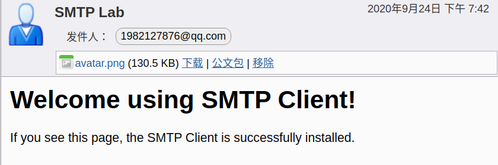

# Usage

**environment**: Ubuntu 18.04, Python 3.6

## Web-Server

```bash
$ python3 webserver.py # then access http://127.0.0.1:8888 in your browser
```

## Web-Client

```bash
$ python3 webclient.py www.baidu.com
HTTP/1.1 200 OK
Bdpagetype: 1
Bdqid: 0xb104bdf100058d87
Cache-Control: private
Connection: keep-alive
Content-Type: text/html;charset=utf-8
Date: Fri, 25 Sep 2020 03:04:34 GMT
Expires: Fri, 25 Sep 2020 03:04:34 GMT
....
```

```bash
$ python3 webclient.py 39.105.64.84 80 /salon/
HTTP/1.1 200 OK
Server: nginx/1.14.0 (Ubuntu)
Date: Fri, 25 Sep 2020 03:08:39 GMT
Content-Type: text/html; charset=utf-8
Content-Length: 4794
Connection: keep-alive

<!doctype html>
<html lang="zh-CN">
...
</html>
```

```bash
$ python3 webclient.py 127.0.0.1 6789 /HelloWorld.html
HTTP/1.1 200 ok
Content-Type: text/html

<!DOCTYPE html>
<html>
<head>
<title>Welcome to Socket WebServer!</title>
<style>
    body {
        width: 35em;
        margin: 0 auto;
    }
</style>
</head>
<body>
  <h1>Welcome to Socket WebServer!</h1>
  <p> If you see this page, the socket web server is successfully installed. </p>

</body>
</html>
```

## SMTP Client

```bash
$ python3 SMTPClient.py
```



## UDP Pinger

**Step 1**

```bash
$ python3 UDPPingerServer.py
```

**Step 2**

```bash
$ python3 UDPPingerClient.py
#0 Request timed out
#1 Request timed out
#2 Ping 0.000331s
   THIS IS A PING MESSAGE 1601003800.2817574
#3 Ping 0.000257s
   THIS IS A PING MESSAGE 1601003800.2821589
#4 Ping 0.000251s
   THIS IS A PING MESSAGE 1601003800.2824814
...
#99 Ping 0.000262s
   THIS IS A PING MESSAGE 1601003838.3439274
min rtt 0.000118s
max rtt 0.000450s
avg rtt 0.000310s
loss rate  60.0000%
```

## Proxy Server

```bash
$ python3 proxyserver.py
```

